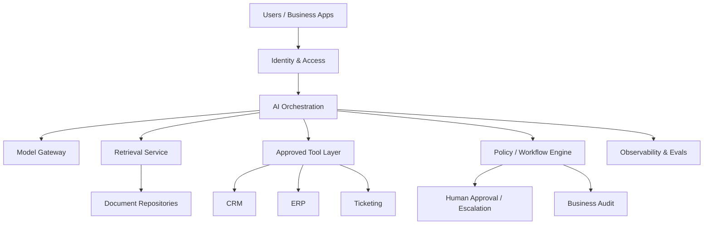

# Target Architecture

## Design goal

Add AI capabilities without giving models uncontrolled access to enterprise systems.



## Boundaries

**Identity & access** owns authenticated identity and authorization context.

**AI orchestration** owns task execution, model calls, tool selection and execution limits.

**Model gateway** centralizes approved models, usage tracking and versioning.

**Retrieval** provides permission-aware access to unstructured knowledge.

**Tool layer** exposes narrow capabilities instead of entire back-office APIs.

**Policy/workflow engine** owns deterministic rules and high-impact state transitions.

**Systems of record** remain authoritative for business truth.

**Observability & evals** capture traces, quality, cost and failures.

**Business audit** records business-significant actions separately from technical telemetry.

## High-impact action pattern

```text
AI proposal
   ↓
schema validation
   ↓
policy
   ↓
authorization
   ↓
human approval if required
   ↓
authorized service
   ↓
system of record
```

> **The model may reason about an action without automatically receiving permission to execute it.**
